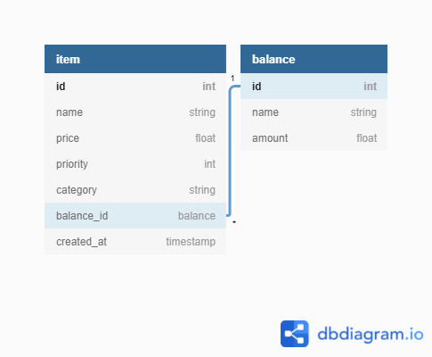

# Wishlist Project

This is only the backend of this project.

## Usage

```
# Install
$bundle install

# Seed the database (optional)
$ bundle exec rake db:seed

# Run the server
$ bundle exec rake server
```

## Diagram


